== Come utilizzare il sistema

Di seguito, si riportano le istruzioni sull'utilizzo del sistema. Saranno
riportate alcuni scenari d'uso tipici con istruzioni passo passo al fine di
permettere un semplice raggiungimento degli obiettivi prefissati.

=== Requisiti hardware

Per poter utilizzare il sistema è necessario disporre di una connessione a
internet (a meno che il sistema non sia installato sulla propria macchina, come
descritto nel <<installazione>>). Non è necessario alcun tipo di hardware
aggiuntivo al fine di utilizzare il sistema. Tuttavia, per poter usufruire delle
funzionalità di analisi di video registrati in tempo reale è necessaria una
webcam (anche esterna) per registrare i video e un microfono (opzionale) per
registrare l'audio.

=== Requisiti software

Per utilizzare il sistema non è necessario installare software aggiuntivo ne
compiere alcuna operazione particolare (salvo l'eventuale installazione qualora
si decidesse di utilizzare una versione non on-line del sistema, come descritto
nel <<installazione>>) in quanto _Emotionally_ è un sistema basato sul web.
Questo significa che per poterlo utilizzare è semplicemente necessario un
browser e un collegamento a internet (qualora il sito non fosse installato).

È tuttavia fortemente consigliato l'utilizzo del *browser _Firefox_*
(https://www.mozilla.org/firefox/) a causa di alcuni problemi legati al browser
Chrome e Chromium (e derivati).

WARNING: I problemi riscontrati nei browser _Chromium-based_ (Chromium, Chrome,
ecc.) non comportano una inutilizzabilità del sistema, ma potrebbero essere
fonti di errori e comportamenti anomali che non è possibile prevedere. Per tale
motivo, per godere di un'esperienza d'uso che sia la migliore possibile, è
fortemente consigliato l'utilizzo di _Firefox_.

=== Utilizzo del sistema

==== Registrazione e verifica mail

Una volta entrato nel sistema si può effettuare la registrazione cliccando sul pulsante _Login_, presente in alto a destra. 

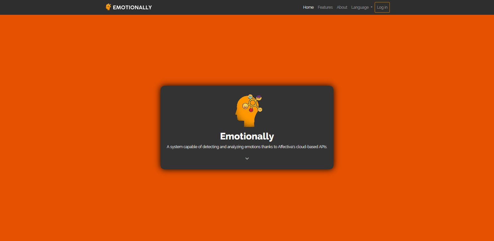

Una volta aperta la pagina di login, sarà sufficiente cliccare sul link _Sign Up_.

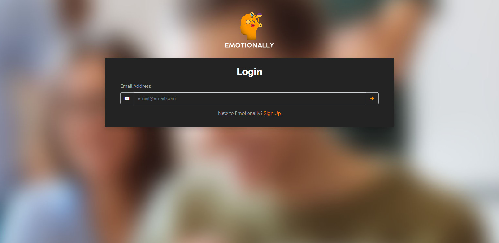

Si aprirà la pagina di registrazione dove sarà necessario inserire i seguenti dati:
- Nome
- Cognome
- Indirizzo E-Mail (necessario per il login al sistema)
- Password
- Password di conferma

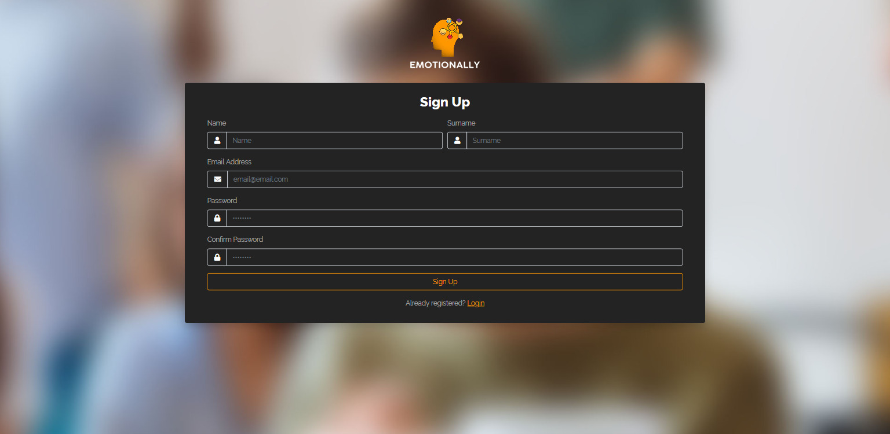

Successivamente al click del bottone _Sign-Up_ verrà inviata una mail all'indirizzo inserito con un link per verificarla.

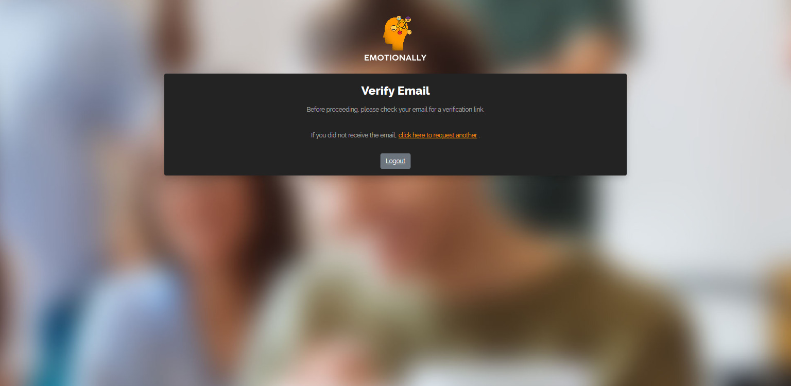

Sarà necessario accedere alla casella di posta e cliccare sul bottone _Verify mail_ presente all'interno della mail ricevuta dal sistema.

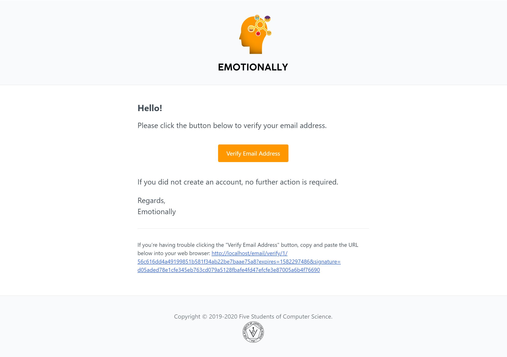

Cliccato il bottone _Verify mail_, si verrà indirizzati alla dashboard del sistema.

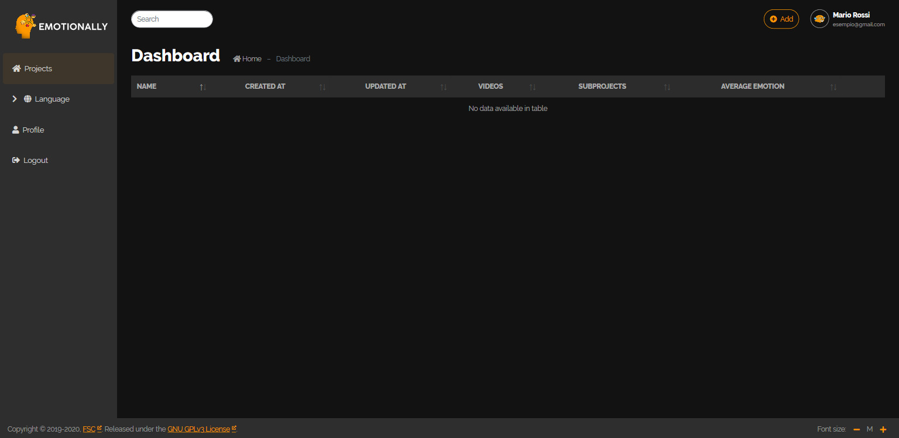

==== Login 

Per effettuare il _Login_ è necessario visitare la _Landing Page_ e, successivamente, cliccare sul bottone _Log In_, presente in alto a destra.

Si aprirà la pagina di _Log In_ nella quale sarà necessario inserire la mail:

Dopo aver inserito la mail, premendo il pulsante invio (o cliccando sulla freccia), sarà possibile inserire la password:

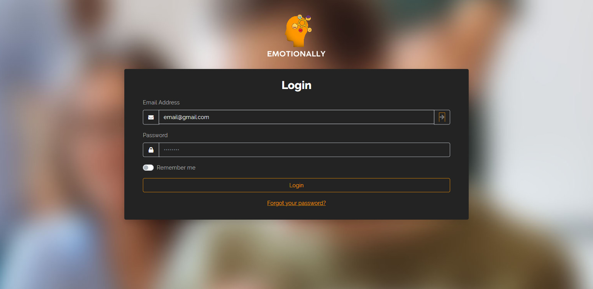

Il toggle _Remember me_ permette di non perdere il login anche se si chiude il browser. Cliccando sul bottone _Login_, se i dati inseriti sono corretti, si potrà accedere al sistema.

_**N.B.** Se la mail non è stata verificata, si entrerà nella pagina di verifica mail (illustrata nella sezione <<Registrazione e verifica mail>>) e non sarà possibile accedere al sistema.

==== Dashboard

Una volta completata la fase di login, l'utente verrà reindirizzato nella _Dashboard_ del sistema, contente l'elenco dei progetti dell'utente.

===== Sidebar

Sarà possibile inoltre interfacciarsi alla siderbar presente sulla sinistra, contenente le sezioni _Progetti_, _Lingua_, e _Profilo_.

image::../../screenshots/dash+lingua.jpeg[alt=lingua]

Dalla sezione _Lingua_ l'utente sarà in grado di cambiare la lingua di sistema in Italiano o Inglese a seconda delle sue preferenze.

===== Parte destra

La Dashboard presenta un bottone _Aggiungi_ che permette di creare un progetto. Cliccando su di esso l'utente potrà dare un titolo al progetto che intende creare e confermare la sua scelta.

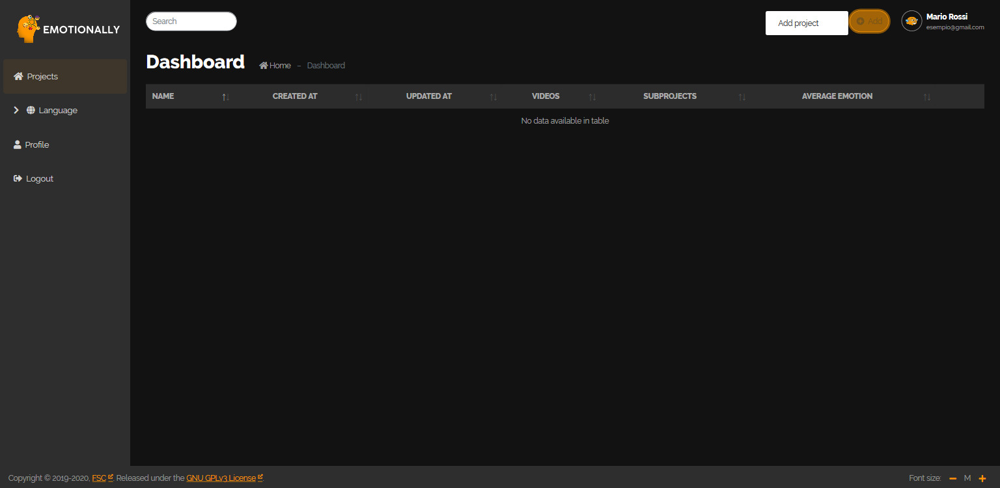

===== Creazione di un progetto

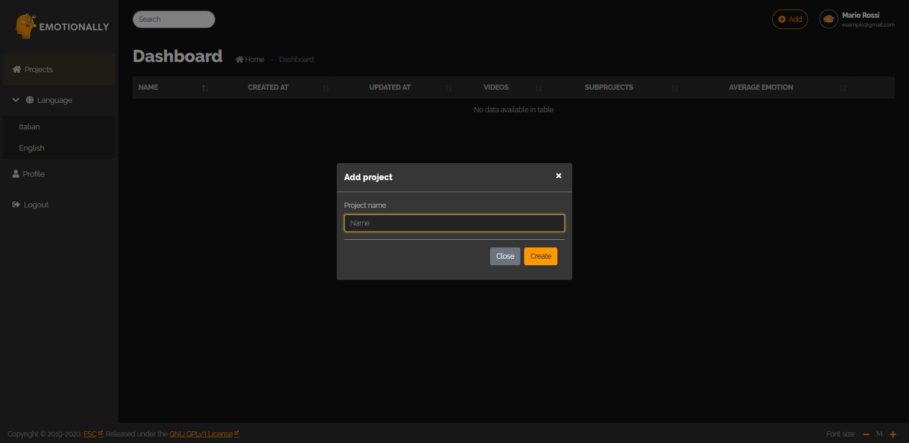

image::../../screenshots/creaprogetto2.jpg[alt=Progetto creato]

Un messaggio di conferma verrà mostrato ad operazione completata. In caso di errore l'utente verrà notificato di un un problema durante l'operazione.

Una volta terminata l'operazione, il nuovo progetto apparirà nella _Dashboard_.

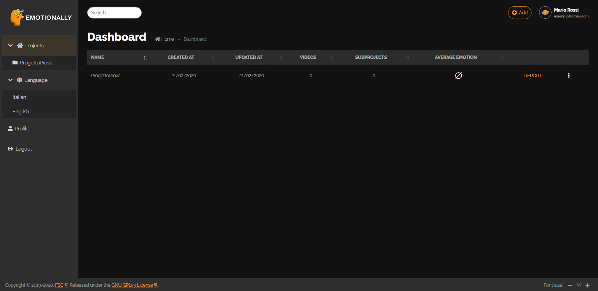

Sarà possibile _rinominare_, _eliminare_, o _gestire i permessi_ del progetto appena creato cliccando sul pulsante _Altre Opzioni_

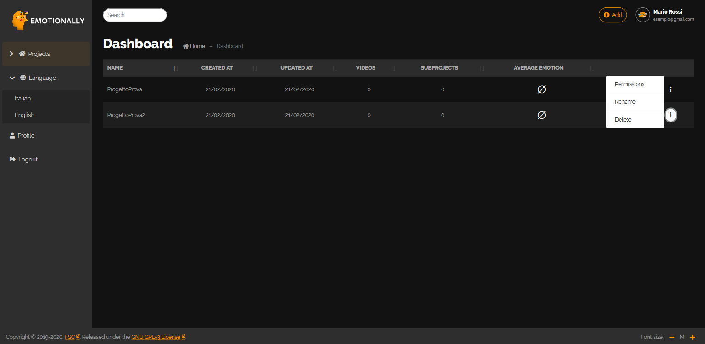

Inoltre, sarà possibile visualizzare l'intero <<Report del progetto>> semplicemente cliccando sull'apposito tasto _Report_.

===== Permessi

La sezione _Permessi_ permette di scegliere quali utenti possono effettuare operazioni di lettura, modifica, aggiunta o rimozione in un determinato progetto. 

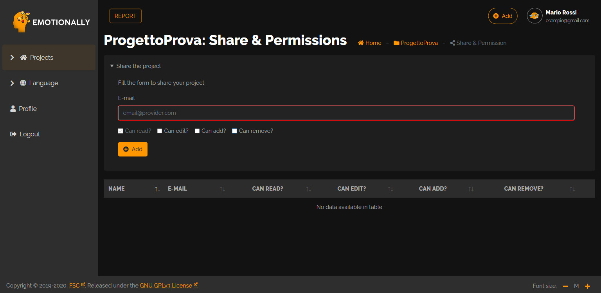

Basterà inserire l'email dell'utente di cui si vogliono modificare i permessi e selezionare le operazioni che potrà effettuare.

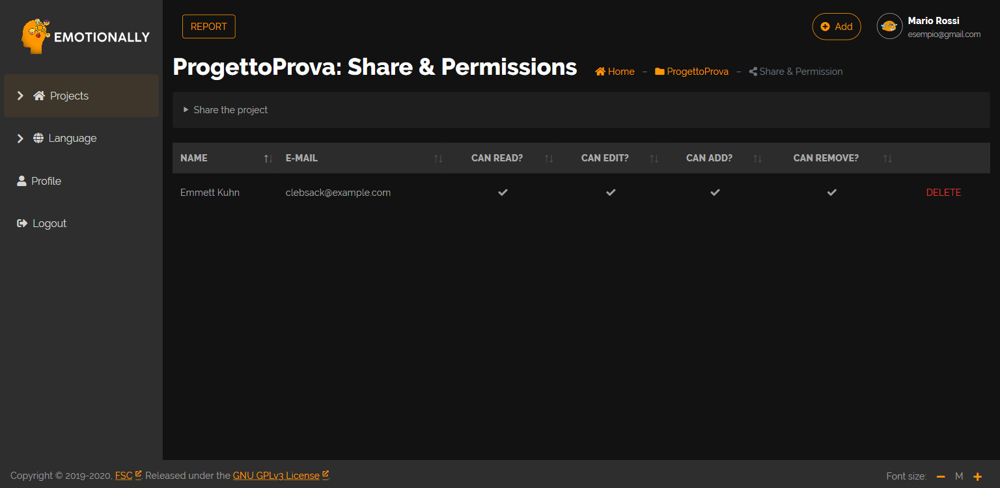

===== Rinominare un progetto

Il pulsante _Rinomina_ permette di rinominare un progetto già esistente.
Una volta selezionata l'opzione, il sistema chiederà all'utente di inserire un nuovo nome per il progetto selezionato.

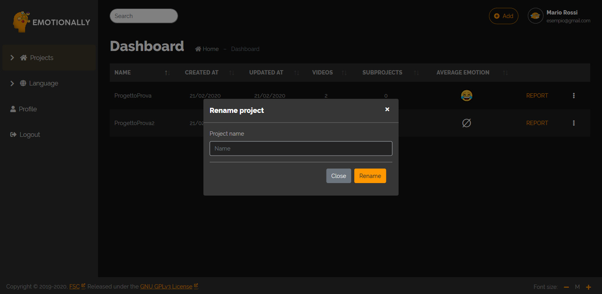

Il sistema notificherà poi l'utente dell'esito dell'operazione.

===== Spostare un progetto o un video

Il pulsante _Sposta_ ,accessibile sia cliccando sulle opzioni di un video sia su quelle di un progetto, permette di spostare uno dei due in un altro progetto di proprietà dell'utente.

image::../../screenshots/sposta.jpg 

Selezionata l'opzione, verrà mostrato l'albero dei progetti creati dall'utente, che potrà così scegliere in quale inserire il video/progetto da spostare.

Un messaggio notificherà l'utente dell'esito dell'operazione.

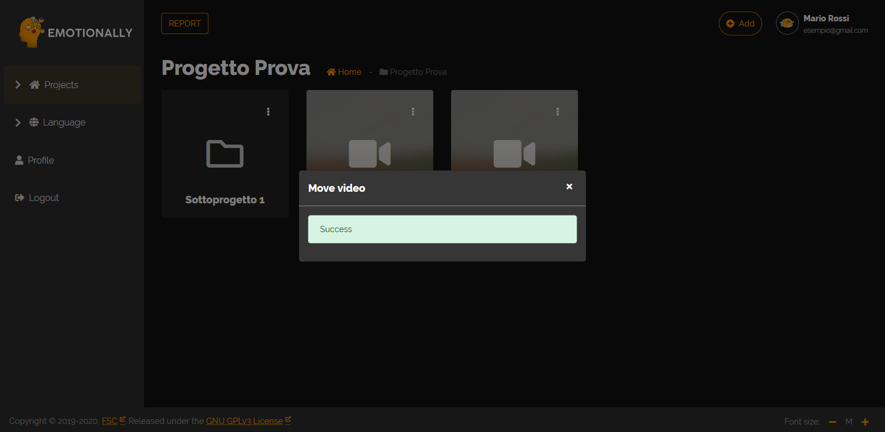

===== Eliminare un progetto o un video

Tramite il pulsante _Elimina_ sarà possibile eliminare un video o un progetto di proprietà dell'utente.

L'eliminazione di un progetto comporterà anche l'eliminazione di tutti i sottoprogetti e i video al suo interno.

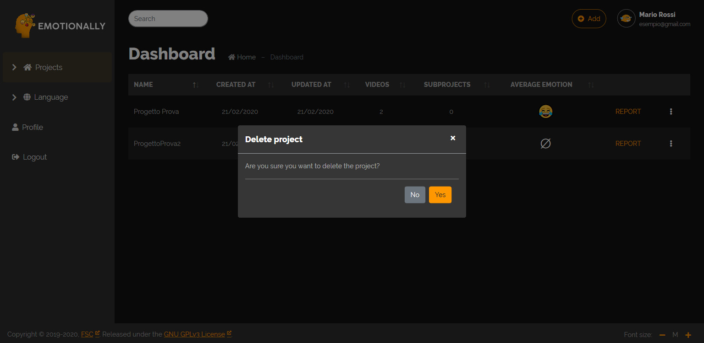

Un messaggio notificherà l'utente dell'esito dell'operazione.

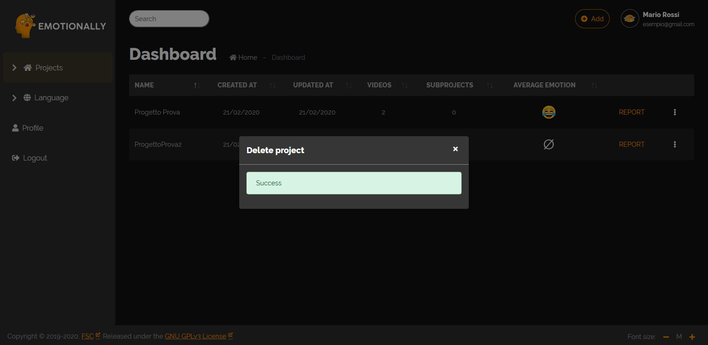

==== Navigazione all'interno di un progetto

Per navigare all'interno di un progetto è necessario sceglierlo dalla tabella prensente nella _Dashboard_:

Cliccando sul progetto desiderato, si entrerà nella pagina di navigazione dello stesso. Appariranno i sottoprogetti e i video che esso contiene, come se fosse una cartella del sistema operativo.

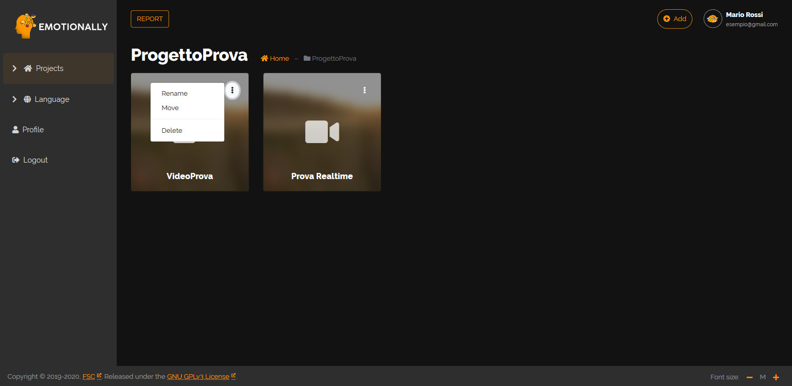

E' possibile, durante la navigazione, effettuare le operazioni di:
- Creazione di un sottoprogetto
- Caricamento di un video
- Registrazione di un video in tempo reale
- Gestione dei permessi di un sottoprogetto
- Visualizzazione del report di un sottoprogetto
- Visualizzazione di un report del video

Qui di seguito verranno illustrate tutte le operazioni sopracitate.

===== Creazione di un sottoprogetto

Per creare un sottoprogetto si può fare riferimento al paragrafo <<Creazione di un progetto>>.

===== Caricamento di un video

Per caricare un video all'interno di un progetto o sottoprogetto è sufficiente cliccare il pulsante _Add_, presente in alto a destra.

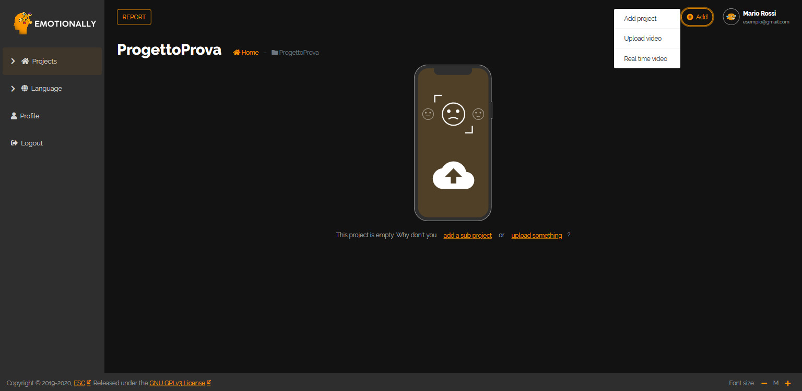

Successivamente è necessario cliccare il link _Upload video_

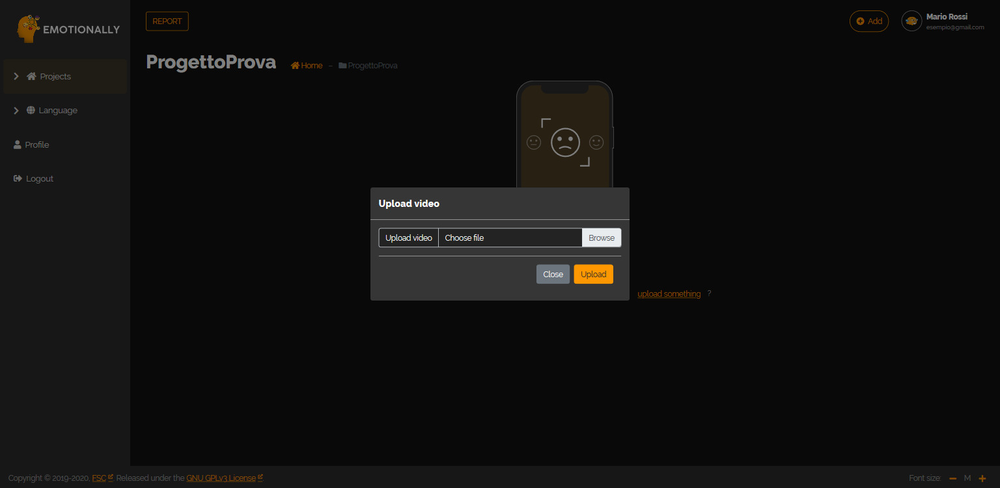

Cliccando il campo _Choose file_ si aprirà l'esplora risorse del sistema operativo da cui si potrà selezionare uno o più video. 

Successivamente apparirà un selettore da cui si potrà selezionare la frequenza di analisi per secondo.

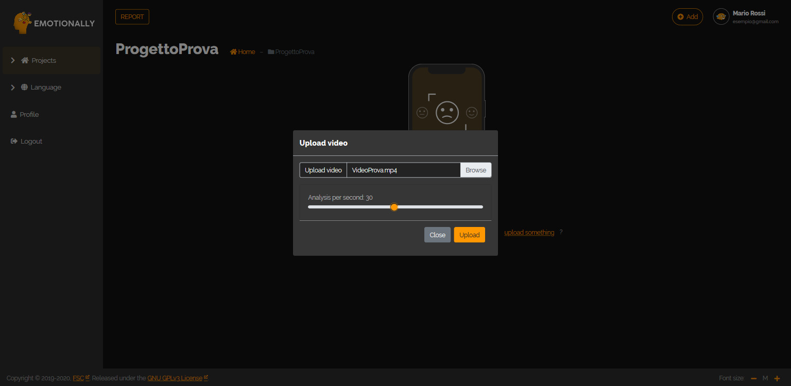

Per finalizzare il caricamento bisognerà cliccare sul pulsante _Upload_.

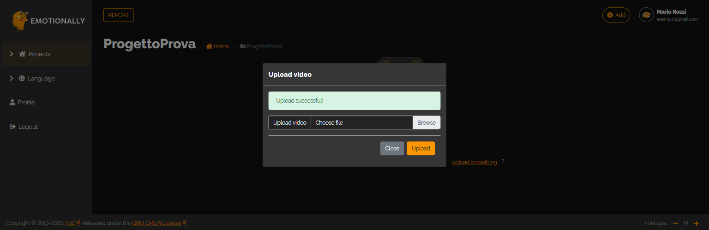

A caricamento effettuato apparirà un alert di avviso e si potranno caricare altri video o tornare al progetto per visualizzarne i report.

===== Registrazione di un video in tempo reale

Per registrare un video in tempo reale e aggiungerlo all'interno di un progetto o sottoprogetto è sufficiente cliccare il pulsante _Add_, presente in alto a destra.

Successivamente è necessario cliccare il link _Real time video_.

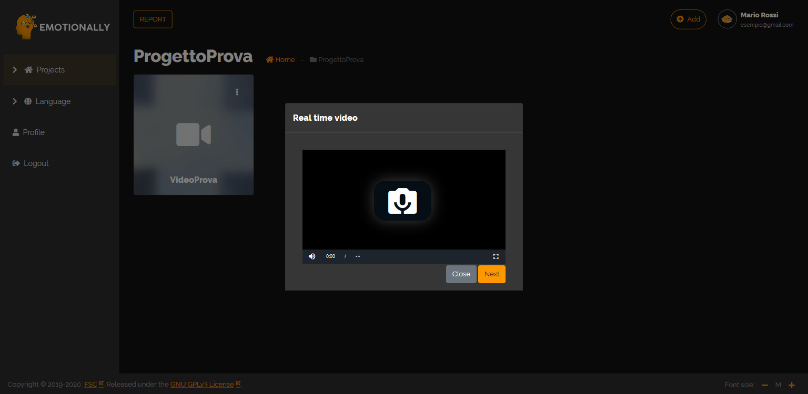

Cliccando sul pulsante al centro del player video il sistema richiederà i permessi per utilizzare la webcam e il microfono al browser. Sarà quindi necessario consentire i permessi per il corretto funzionamento della funzionalità.

Apparirà, quindi, la visualizzazione in tempo reale della webcam e sarà possibile procedere alla registrazione del video cliccando il pallino bianco in basso a sinistra nel player.

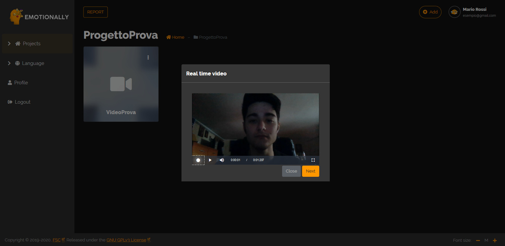

Si potrà poi fermare la registrazione cliccando sul quadrato, che apparirà dopo aver cliccato il pallino. Successivamente, cliccando sul pulsante _Next_ in basso a destra, sarà possibile assegnare un titolo e segliere le analisi per secondo.

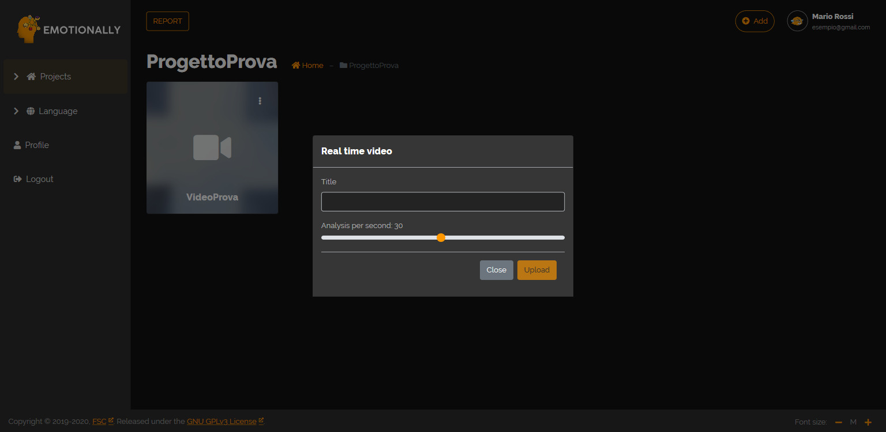

Cliccando poi su _Upload_ si porcederà al caricamento del video e alla successiva analisi.

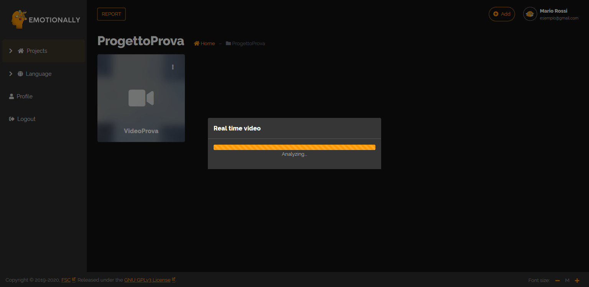

Terminata la procedura sarà possibile tornare alla schermata sottostante e visualizzare il report del video o procedere con le altre funzionalità.

===== Gestione dei permessi di un sottoprogetto

All'interno della navigazione è possibile accedere ai permessi di un sottoprogetto per aggiungerli, modificarli o rimuoverli.

Sarà sufficiente cliccare sul pulsante _Menù_ del sottoprogetto desiderato (i tre puntini verticali in alto a destra all'interno del "quadrato") e, successivamente, cliccare sul link _Permissions_.

Si aprirà la pagina dei permessi, già illustrata nella sezione <<Permessi>>.

===== Visualizzazione del report di un sottoprogetto

//TODO

==== Visualizzazione del report di un video

//TODO
